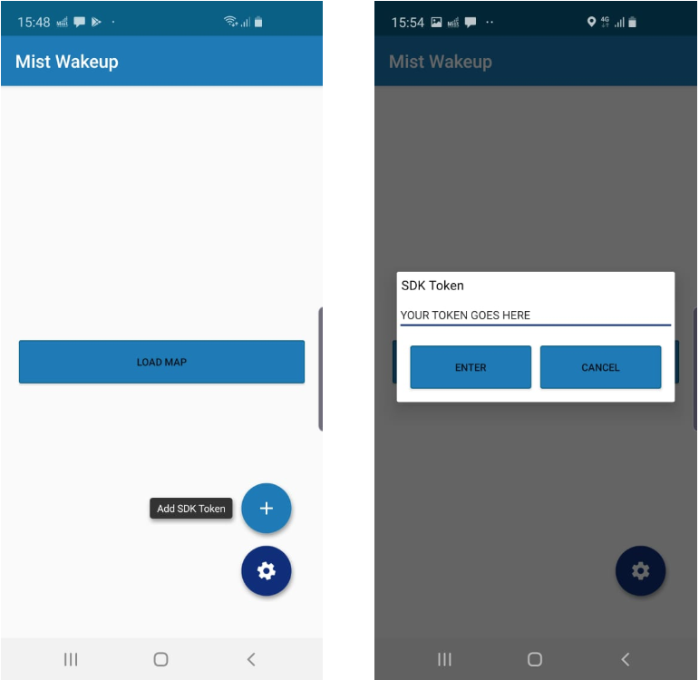

# App Wakeup Sample Code

App wakeup, wakes the app from the killed state when it gets in the range of the registered beacons. This is an OS and app side feature and the SDK role is to provide the information as to which beacons to watch for. The sample code starts the SDK in the background when the callback is received in killed state.

This application depicts the wakeup feature targeted for the mobile client, using the Google Nearby API (https://developers.google.com/nearby/messages/android/get-started)

## Steps to see the App Wakup in action

### 1.) Configure the Site Configuration and AP Configuration

  #### Site Configuration

   * Go to Organization → Site Configuration → (Choose the site) →
     * Bluetooth based Location Services
          * Enable "vBLE Engagement"
          * Enable "App Wakeup"
     * Location
          * Provide location


  #### AP Configuration

  * Each AP in the Site that you would like to broadcast the app wakeup needs to be configured 
  * Go to Access Points → (Choose an Access Point for the site) → BLE Settings
    * Enable "Enable BLE iBeacon"

### 2.) NOT receiving iBeacon information
 * Make sure you are in a place not receiving iBeacon information from any other Mist AP in the organization. Having access to a single AP (that is configured to the org and for a specific site and map) is very beneficial to trying out this steps. Plug-in the Access Point, this will completely boot up. You can tell this by the steady green light. It is now broadcasting iBeacons for the organization.
### 3.) Download sample code 

            https://github.com/mistsys/mist-vble-android-sdk/tree/master/DemoApp/mist-sample-wakeup

### 4.) Get the SDK Secret Key from the Mist portal
   * Go to Organization → Mobile SDK → Copy the key from the "Secret" column (you may need to create an invitation if there is not at least one available)
### 5.) There are 2 ways to use the secret key
   * Add the secret key to the sample app code. This makes the key, the default key of the app.
        * Open the sample app in Android Studio
        * In the HomeFragment.java file set the values of sdkToken to the secret key you got from the portal
   
        ```
        public static String sdkToken = "PPRsreycFg12345sHAKSTAH71gVDULVC";
        ```
        
   * Enter the secret key in the application's UI. This overrides the baked in key in code.
        * Run the application
         * Tap the settings → Tap + (Add SDK Token)
         * Add the Secret key in the text field and click the ENTER button below.
         

       
### 6.) Please make sure you have enabled bluetooth, mobile data / wifi, and location services.
### 7.) Click on Load Map. You will receive a welcome notification.
   * This will use the SDK to get Organization details based on the secret key
   * Based on these details, it will register beacons to monitor for with Core Location
   
### 8.) Turn off / Unplug the Access Point. 
  * This means no iBeacons are broadcasting from your organization that the phone can receive.
### 9.) Kill the Wake-up application.
### 10.) Clear the WakeUp app's welcome notification.
### 11.) The phone is now monitoring for iBeacons. 
  * Make sure the phone is not locked. (App Wake-up notification will not work when the phone is locked)
### 12.) Turn On/ Plug-in the Access Point to start broadcasting iBeacons
### 13.) The Wake-up Notification will show after some time. 
  * This signifies that the SDK is connecting to Mist
### 14.) SDK Connected
  * Once the SDK has connected it reports the beacons it hears and this gives the Mist portal data to use in calculating the location of the deviceGo to the Mist portal live view for the map that the AP is configured in
      * Location → Live View → (Choose the Site) → (Choose the Map)
      * At this point, a blue person icon should be displayed near the AP (green square) you are using. This confirms that the SDK is connected and the portal is getting the beacon data.   
      
      

-------------------------------------------

## Major classes and usage

#### MistManager
    This is the manager class which is doing all the interaction between Mist core SDK and App

#### MapFragment
    This is the fragment which is used to render the map/bluedot with the info received from the Mist SDK.
    This class also check for permission provided and the availability of network/bluetooth/location.
    MapFragment is responsible to start the SDK from the Token info it got from the AddTokenDialogFragment

#### AddTokenDialogFragment
    This is a dialog fragment to get the SDK token from the User on click of fab icon

#### HomeFragment
    This fragment is the initial view attached to MainActivity and have fab icon which will launch 
    AddTokenDialogFragment
    
#### MISTSDKBackgroundService
    This is a job service which can be scheduled/unscheduled as per need, like when got the onFound 
    of the beacon registered for wakeup
    
#### NearByJobIntentService
    This is a job intent service which will be enqued for work when NearByBroadCastReceiver's onReceive is triggered   
        
#### NearByBroadCastReceiver
    This is a broadcast receiver  which is past as pendingIntent to Nearby.Messages.subscribe and 
    it will be the one which will enque the work of NearByJobIntentService
    
    
#### Utility/POJO(model) classes
    SharedPrefUtils : Utility for Shared preference
    Utils : general utility class
    OrgData : POJO to save the org info got from enrollment 
    
### Main callbacks leveraged for this sample app
    onRelativeLocationUpdated : for location details
    onMapUpdated : for map details

### More details

For more details please visit https://github.com/mistsys/mist-vble-android-sdk/wiki#app-wake-up and https://github.com/mistsys/mist-vble-android-sdk/wiki#background-mode
